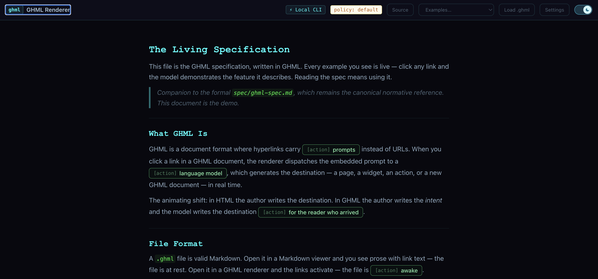
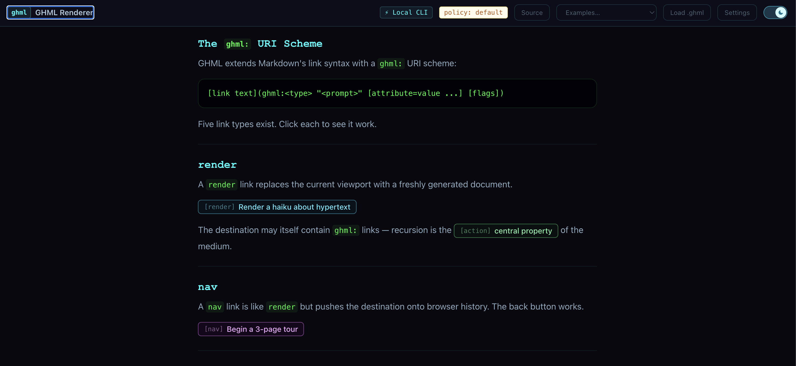
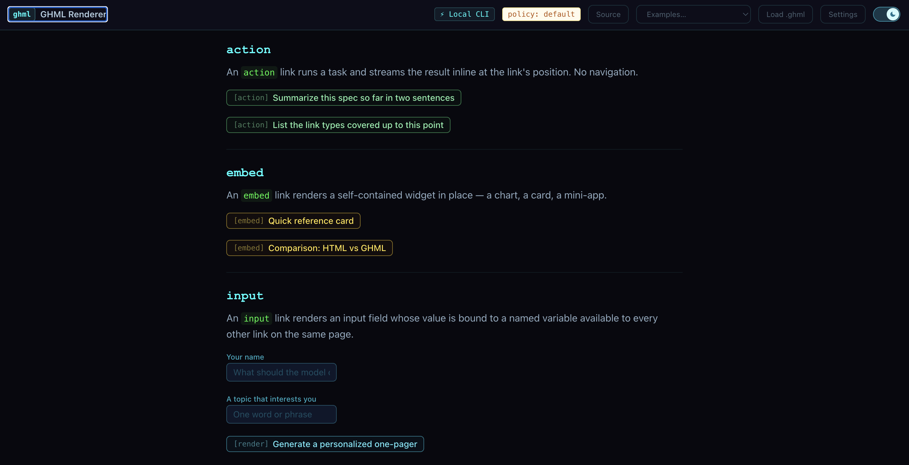
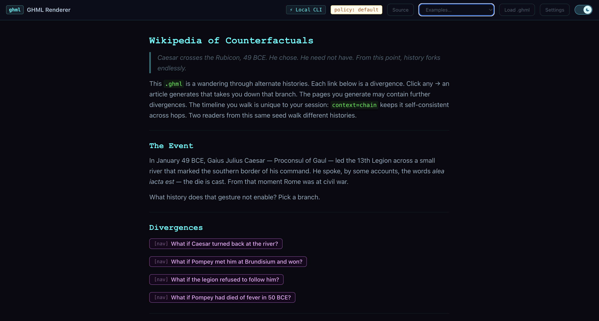
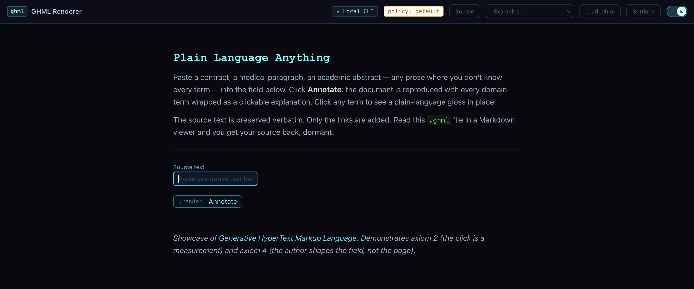

# GHML — Generative HyperText Markup Language

> *The document is a scaffold. The LLM is the runtime.*

GHML is a document format where hyperlinks carry **prompts** instead of URLs. When a user clicks a link, the prompt is dispatched to an LLM which generates the destination in real time.

**Status:** Pre-specification POC — v0.1.0, May 2026  
**Author:** Andrey Kasianov (original concept)

---

## Screenshots



*`living-spec.ghml` — the spec written in itself. Every example you read is live; clicking any link asks the model to demonstrate the feature it describes.*



*The same file, scrolled to the `render` and `nav` link-type sections — each `[render]` / `[nav]` pill is itself a live demonstration of what it explains.*



*Further down: inline `action` results, self-contained `embed` widgets, and `input` fields whose values bind to `{{variables}}` consumed by the next link on the page.*



*`counterfactuals.ghml` — Caesar at the Rubicon seeds an unfolding tree of alternate histories. `context=chain` keeps every branch self-consistent; two readers from the same seed walk different timelines.*



*`plain-language-anything.ghml` — paste a contract, an abstract, or a medical paragraph; every term becomes a clickable plain-language gloss in place. The source text is preserved verbatim.*

---

## What's in this repo

| Path | Contents |
|---|---|
| `spec/ghml-spec.md` | Formal specification with EBNF grammar |
| `spec/ghml-schema.json` | JSON Schema for link attributes |
| `spec/examples/sample.ghml` | Sample document exercising all link types |
| `examples/` | Showcase `.ghml` files — pitches for the medium, not syntax tutorials |
| `docs/philosophy.md` | *Propositions on the Virtual Document* — the philosophy of GHML |
| `renderer/` | Standalone web app (React + TypeScript + Vite) |
| `policy/policy-schema.yaml` | YAML policy schema (model allowlist + cost caps) |
| `policy/examples/` | Example policy files |

---

## Quick Start (renderer)

### Option A — Anthropic API key

You need an Anthropic API key from [console.anthropic.com](https://console.anthropic.com).

```bash
cd renderer
npm install
npm run dev
```

Open `http://localhost:5173`, click **Settings**, select **API** as the provider, paste your key, then click any link on the page.

### Option B — Claude Code (local, no API key needed)

If you have [Claude Code](https://claude.ai/code) installed:

```bash
cd renderer
npm install
npm run dev
```

Open `http://localhost:5173`, click **Settings**, switch **Provider** to **Local CLI**. The Vite dev server proxies requests directly to the `claude` CLI — no API key required.

Pick a bundled showcase from the **Examples…** dropdown in the header, or click **Load .ghml** to open one from disk. Toggle the **Clean / Cyber ⚡** button to switch themes.

---

## GHML Syntax

```markdown
[link text](ghml:<type> "<prompt>" [key=value ...] [flags])
```

**Link types:** `render` (replace view) · `nav` (replace + history) · `action` (inline result) · `embed` (inline widget)

**Key attributes:** `model` · `context` · `inline` · `width` · `cache` · `fallback` · `policy`

**Context values:** `page` · `user` · `selection` · `data` · `chain` · `dom`

**Variable interpolation:** `{{user.name}}`, `{{data.field}}`

### Examples

```markdown
[Introduction](ghml:render "Generate a friendly overview of topic X")

[Summarise](ghml:action "Summarise the page above in 3 bullet points" context=page inline)

[My dashboard](ghml:render "Build a dashboard for {{user.name}}" context=user model=claude-opus-4-7)

[Continue story](ghml:nav "Continue the story based on my choices so far" context=chain)
```

---

## Recursive Property

Generated pages can themselves contain `ghml:` links — a single seed document can spawn an infinitely deep, contextually coherent experience.

---

## Prior Art & Related Work

- **Google Generative UI** (arXiv 2604.09577, 2025) — validates LLM-generated HTML; GHML extends this to navigation
- **Google A2UI** (Dec 2025) — declarative agent-to-UI; relevant to GHML's output sandboxing model
- **HTMX** — server-rendered HTML-over-the-wire; GHML is the LLM analogue
- **Ted Nelson / Transclusion** — GHML generates rather than retrieves

The core concept — embedding LLM prompts inside documents as hyperlinks that generate destinations on click — appears to be novel as of May 2026.

---

## License

MIT
